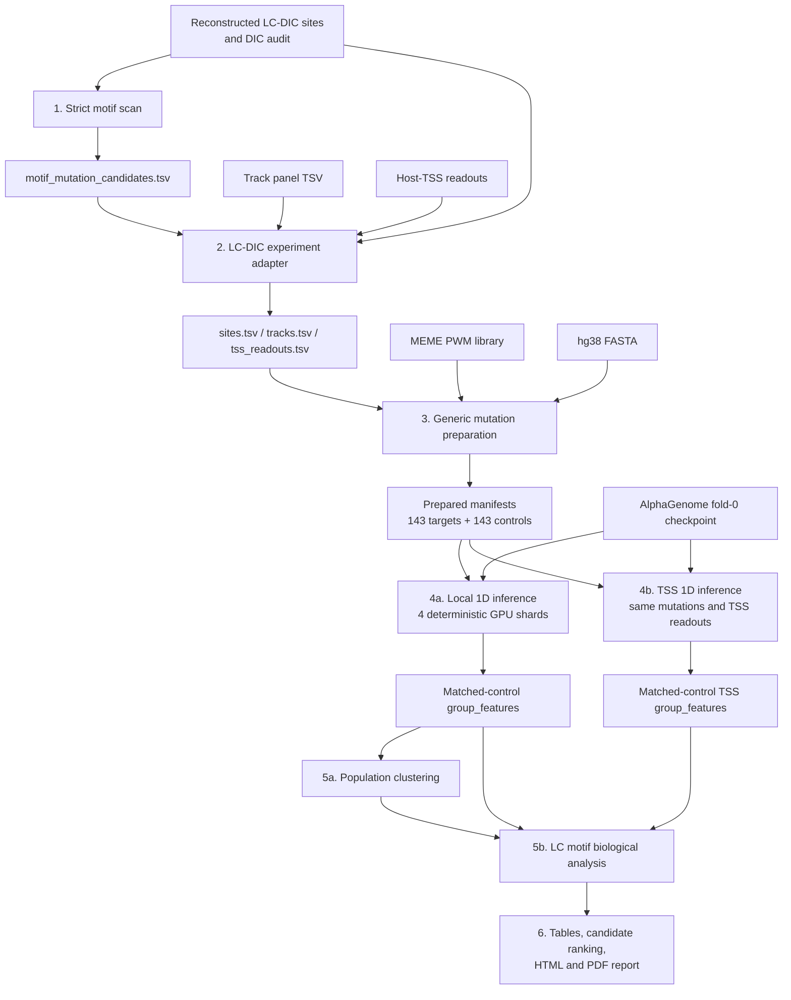

# LC-DIC motif batch ISM: current code design

Last updated: 2026-06-13

## 1. Scope

This document describes the code architecture of the completed formal
LC-DIC motif perturbation experiment:

- select LC-DICs with an audited real Pol2 peak and summit;
- scan literature-guided motifs inside the same Pol2 peak;
- disrupt the three highest-contribution PWM positions;
- generate one same-peak, non-motif control with matched edit length and GC
  change;
- run AlphaGenome 1D ChIP heads at 128 bp resolution;
- summarize local multiscale and host-TSS effects;
- perform population clustering and motif-family statistics;
- generate the final PDF report.

Contact-map inference is deliberately outside this completed pipeline. It is
the next experiment and should reuse the prepared mutation manifests rather
than redesign the mutations.

For the exact commands, parameters, shard assignments and formal artifact
boundary used in the completed run, see:

```text
experiment/lc_dic_motif_runbook.md
```

For the existing HC-DIC population report and rerun notes, see:

```text
experiment/hc_dic_runbook.md
```

The HC-DIC analysis reuses the same manifest, mutation-preparation, inference,
and population-clustering layers, but it uses the older `ctcf_pwm_disruption`
strategy and has no named host-TSS batch readout.

## 2. Design goals

The implementation follows three practical rules.

1. **Manifests are the stable interfaces.** Sites, tracks, mutations, readouts,
   and QC are plain TSV files. Statistical outputs are TSV or parquet.
2. **Expensive inference is separated from experimental policy.** Motif
   selection and mutation design happen before loading AlphaGenome. Statistical
   analyses consume reduced feature tables, not model tensors.
3. **Likely-to-change policies are replaceable.** Mutation and feature-summary
   strategies use registries. Site adapters, track panels, readout builders,
   and analysis scripts are process-level components that can be replaced
   without introducing a workflow framework.

This is intentionally a small batch system, not a general workflow engine.

## 3. End-to-end data flow



The important separation is between stages 3 and 4. Once
`mutation_manifest.tsv` is prepared and reviewed, model inference no longer
decides what to mutate.

## 4. Repository layout and ownership

### 4.1 Reusable batch infrastructure

`src/grelu/interpret/ism/batch.py`

This is the main reusable layer. It owns:

- validation of site and track manifests;
- mutation-strategy and summary-strategy registries;
- construction of target/control mutation manifests;
- common AlphaGenome context constraints;
- track metadata resolution;
- matched-control feature adjustment.

It does not know what an LC-DIC is and does not perform LC-specific statistics.

Related reusable modules under `src/grelu/interpret/ism/` provide lower-level
motif, sequence, track, inference, artifact, and provenance helpers.

### 4.2 Experiment adapters and runners

`scripts/ism/`

These scripts express the current experiment:

| Script | Responsibility |
|---|---|
| `scan_lc_dic_motifs.py` | Strict Pol2-anchored motif discovery and candidate selection |
| `make_dic_tss_readouts.py` | Map a DIC to a containing-gene proxy TSS and build a 4 kb readout |
| `make_lc_motif_batch_inputs.py` | Convert LC-specific candidates into generic site, track, and readout manifests |
| `prepare_batch_ism.py` | Thin CLI over generic mutation preparation |
| `run_batch_1d_features.py` | Resumable AlphaGenome REF/ALT inference and feature reduction |
| `analyze_batch_population.py` | Generic entry point for population clustering |
| `analyze_real_ctcf_group_features.py` | Clustering representations, stability, provenance, and shard-confounding checks |
| `analyze_lc_motif_effects.py` | LC motif-family, local, TSS, enrichment, and ranking statistics |
| `build_lc_motif_pdf_report.py` | Static figures, HTML report, and report metadata |

### 4.3 Formal experiment artifacts

```text
outputs/lc_dic_motif_scan_pol2_0.90/
data/DICs/lc_motif_pol2_batch_inputs/
data/DICs/lc_motif_pol2_batch_prepared/
outputs/lc_motif_pol2_1d_shard{0..3}/
outputs/lc_motif_pol2_tss_shard{0..3}/
outputs/lc_motif_pol2_population_analysis/
outputs/lc_motif_pol2_effect_analysis/
agent-doc/ism_context/20260613_1844_lc_dic_motif_batch_report/
```

The `outputs/` directories are run products. The prepared directory is the
reviewable experiment definition that should be treated as the boundary
between experiment design and inference.

## 5. Stage 1: strict Pol2-anchored motif scan

Entry point:

```text
scripts/ism/scan_lc_dic_motifs.py
```

### Inputs

- reconstructed LC-DIC site table;
- `data/DICs/dic_site_audit.tsv`;
- hg38 FASTA;
- H13CORE MEME motif library;
- optional prior cluster assignments for exploratory enrichment.

### Policy

The scanner:

1. keeps `site_class == lc_dic`;
2. joins the DIC audit one-to-one by `site_id` and chromosome;
3. selects the first real Pol2 peak/summit in condition priority:
   `Ctrl -> E2-30 -> E2-45`;
4. excludes sites without a real peak and summit;
5. scans only `anchor +/- 100 bp`;
6. requires the complete motif interval to lie inside the selected Pol2 peak;
7. keeps the best hit per source site and motif label;
8. collapses FOS/JUN into the AP1 family and retains one candidate per
   site-by-family.

The panel is currently defined in code:

```text
FOXA1 -> Forkhead
ESR1  -> ESR1
GATA3 -> GATA3
FOS/JUN -> AP1
TEAD4 -> TEAD4
```

The formal scan threshold is relative PWM score `>= 0.90`.

### Outputs

The central output is:

```text
outputs/lc_dic_motif_scan_pol2_0.90/motif_mutation_candidates.tsv
```

Supporting tables retain all hits, best hits, per-site motif presence, and
sites skipped because no audited Pol2 peak exists.

### Current formal counts

- 168 audited LC-DICs with a real Pol2 peak/summit;
- 108 source LC-DICs with at least one qualifying panel motif;
- 144 site-by-motif-family candidates.

The scanner is LC-specific. A different biological experiment should normally
add another adapter/scanner rather than add more conditionals to this script.

## 6. Stage 2: LC-specific manifest adapter

Entry point:

```text
scripts/ism/make_lc_motif_batch_inputs.py
```

The adapter converts biological candidate tables into the generic batch
contract.

### Main validation

For every candidate it verifies that:

- a selected Pol2 peak interval exists;
- the motif lies fully inside that peak;
- the motif center is within 100 bp of the true Pol2 summit;
- the generated `site_id` is unique.

It also attaches source-site signal covariates:

- `rad21_ctrl_signal`;
- `ctcf_ctrl_signal`;
- `pol2_ctrl_signal`.

These covariates are not model outputs. They are later used to test whether
population clusters merely reproduce baseline signal strength.

### Input contract produced

`sites.tsv` has generic required columns:

```text
site_id, site_class, chrom, start, end, mutation_strategy
```

The LC motif strategy additionally needs:

```text
source_site_id
motif_family, motif_label
motif_path, motif_name
motif_start, motif_end, motif_strand, motif_sequence
min_relative_motif_score
panel_motif_path, panel_motif_names
control_region_start, control_region_end
```

The adapter sets:

```text
mutation_strategy = motif_pwm_disruption
site_class = lc_dic_motif
```

`tracks.tsv` is copied as data rather than embedded in the runner. This is the
main interface for changing output tracks.

`tss_readouts.tsv`, when supplied, maps source LC-DIC IDs onto every
site-by-family candidate so that multiple motifs at one LC-DIC share the same
host-TSS definition.

## 7. Stage 3: generic mutation preparation

CLI:

```text
scripts/ism/prepare_batch_ism.py
```

Implementation:

```text
src/grelu/interpret/ism/batch.py::prepare_batch_manifests
```

This stage is CPU-only and must finish before AlphaGenome is loaded.

### 7.1 Mutation strategy registry

Strategies are registered by name:

```python
@register_mutation_strategy("motif_pwm_disruption")
def prepare_motif_pwm_disruption(row, context):
    ...
```

Built-in strategies currently include:

- `ctcf_pwm_disruption`;
- `motif_pwm_disruption`;
- `center_substitution`;
- `explicit_edit`.

Additional modules can register a strategy and be loaded with:

```text
--strategy-module package.module
```

This is the primary mutation-policy plugin point. The runner only sees the
prepared edit coordinates and sequences.

### 7.2 Formal motif edit

For `motif_pwm_disruption`, the strategy:

1. reloads the PWM named in the site row;
2. verifies motif coordinates, strand, FASTA sequence, width, and score;
3. designs an equal-length edit at three high-contribution PWM positions;
4. requires the edited motif score to fall below the configured threshold;
5. rescans the local panel and rejects an edit that creates a new
   high-scoring panel motif.

The mutation manifest stores both scores and QC evidence:

```text
ref_pwm_score, alt_pwm_score
ref_pwm_relative_score, alt_pwm_relative_score
edited_base_count, gc_delta_count
fasta_ref_match, qc_status
```

### 7.3 Matched control

The formal experiment requests one matched control per target. The control:

- lies in the same selected Pol2 peak;
- does not overlap the target motif;
- avoids all high-scoring panel motifs;
- changes exactly three bases;
- has the same GC-count change as the target;
- shares the target's 1,048,576 bp AlphaGenome context center.

The pairing key is `matched_target_id`.

The formal result is:

- 143 ready targets;
- 143 matched controls;
- 286 mutation rows;
- one candidate skipped because no valid three-base disruption lowered its
  motif score below 0.90.

### 7.4 Prepared output contract

```text
site_manifest.tsv       all requested sites plus preparation status
ready_sites.tsv         inference-ready sites only
mutation_manifest.tsv   exact target and control edits
track_registry.tsv      requested model tracks
readout_manifest.tsv    default or supplied genomic readouts
preparation_qc.tsv      one-row-per-site preparation audit
```

The most important manual review files are
`mutation_manifest.tsv`, `ready_sites.tsv`, and `preparation_qc.tsv`.

## 8. Stage 4: AlphaGenome 1D inference

Entry point:

```text
scripts/ism/run_batch_1d_features.py
```

### Fixed model behavior

- AlphaGenome input context: `1,048,576 bp`;
- checkpoint: local fold-0 safetensors;
- resolution: `128 bp`;
- formal heads: `chip_tf` and `chip_histone`;
- formal track count: 15;
- local summary windows: `1,024`, `4,096`, `20,000`, and `100,000 bp`.

Track IDs are resolved at runtime against AlphaGenome track metadata. The
resolved track index, exact/fallback biosample, and fallback reason are written
to `track_selection.tsv`.

### REF/ALT execution

For each mutation row:

1. extract the shared 1 Mb reference sequence;
2. apply the exact equal-length edit;
3. predict REF and ALT for the selected heads;
4. reduce arrays immediately to bounded summary features;
5. write one parquet chunk per mutation.

Full prediction arrays are not retained. This keeps storage bounded and makes
the population workflow resumable.

### Feature naming

The default registered summary strategy is `multiscale_log2fc`.

For each track and window it emits stable names such as:

```text
polr2a__w4096__S_ref_mean
polr2a__w4096__log2fc_signed_mean
polr2a__w4096__log2fc_absolute_mean
polr2a__w4096__log2fc_depletion_mean
polr2a__w4096__peak_log2fc
```

The signed bin-level effect is:

```text
log2(1 + ALT) - log2(1 + REF)
```

An alternative summarizer can be registered with
`register_summary_strategy()` and selected through `--summary-strategy`.

### Matched-control adjustment

`mutation_features.parquet` has one row per target or control mutation.

`adjust_population_features()` creates one row per experimental target:

```text
adjusted effect =
    target mutation effect
    - mean(matched control mutation effects)
```

Reference-signal columns are retained from the target. Effect columns are
control-adjusted. The result is `group_features.parquet`.

### Sharding and resume

Sites are deterministically assigned with:

```python
sites.iloc[shard_index::shard_count]
```

The formal run used four shards. Each process can use a separate GPU and output
directory. A mutation is complete when its `chunks/<mutation_id>.parquet`
exists. Re-running the same command skips completed chunks.

After all expected chunks in a shard exist, the runner writes:

```text
mutation_features.parquet
group_features.parquet
group_features.tsv
scored_intervals.tsv
track_selection.tsv
source_sites.tsv
timing.tsv
run_metadata.json
```

`run_metadata.json` records checkpoint, heads, resolution, windows, strategies,
track count, shard identity, and elapsed time.

## 9. Local and TSS passes

Local and TSS effects use the same runner and the same prepared mutations.
They are separate passes because the TSS pass supplies a site-specific readout
table.

### Local pass

No `--readout-table` is supplied. The runner emits centered multiscale
features around the edit.

Formal outputs:

```text
outputs/lc_motif_pol2_1d_shard{0..3}/
```

### TSS mapping

`make_dic_tss_readouts.py`:

- finds genes overlapping the DIC;
- prefers genes containing the DIC center;
- chooses the nearest TSS with deterministic tie-breakers;
- constructs a 4 kb TSS window;
- verifies that the window fits inside the same 1 Mb model context;
- records gene ambiguity instead of silently discarding it.

This is a proxy host-gene mapping, not a loop-supported promoter assignment.

### TSS pass

The runner receives `--readout-table tss_readouts.tsv`. For every selected
track it summarizes REF and ALT over `host_tss_4kb`.

Formal outputs:

```text
outputs/lc_motif_pol2_tss_shard{0..3}/
```

The pass does not rerun mutation design. It reuses the same target/control
manifest so local and TSS effects remain directly comparable.

## 10. Stage 5a: population analysis

Entry point:

```text
scripts/ism/analyze_batch_population.py
```

This is currently a thin alias for:

```text
scripts/ism/analyze_real_ctcf_group_features.py
```

The analyzer merges the four `group_features.parquet` shards and verifies:

- every shard used a real checkpoint;
- checkpoint paths match;
- track selections match exactly;
- row counts match run metadata;
- site IDs are unique;
- feature matrices contain no missing values.

It then compares several feature representations:

- all biological effect features and scales;
- signed/depletion features;
- local 1/4 kb features;
- effects residualized against available baseline signal covariates.

For each representation it performs PCA/clustering model selection and
bootstrap stability analysis. It also reports:

- adjusted Rand index across representations;
- association between cluster labels and inference shard.

The shard check is important: a biologically interpreted cluster must not be a
GPU-shard artifact.

This analyzer predates the LC motif experiment and still has a CTCF-oriented
filename. Its table contract is generic enough for the current run, but the
filename and some historical constants should eventually be cleaned up.

## 11. Stage 5b: LC motif biological analysis

Entry point:

```text
scripts/ism/analyze_lc_motif_effects.py
```

This is intentionally experiment-specific. It consumes:

- all local feature shards;
- all TSS feature shards;
- `ready_sites.tsv`;
- TSS mapping metadata;
- selected population-cluster assignments.

It produces:

- local summaries by motif family, track, and window;
- host-TSS summaries;
- Kruskal-Wallis family comparisons;
- Wilcoxon tests against zero with BH correction;
- local-to-TSS Spearman correlations at distance thresholds;
- response-cluster motif-family Fisher enrichment;
- candidate-level ranking.

Distance thresholds are currently:

```text
0, 10 kb, 50 kb, 100 kb
```

Important output files:

```text
local_track_summary.tsv
tss_track_summary.tsv
tss_distance_summary.tsv
local_tss_correlations.tsv
motif_family_comparisons.tsv
cluster_motif_enrichment.tsv
candidate_ranking.tsv
site_effects.tsv
result_summary.md
```

The script is a statistical consumer. Changing its tests or candidate ranking
does not require another AlphaGenome run as long as the needed feature columns
already exist.

## 12. Stage 6: report generation

Entry point:

```text
scripts/ism/build_lc_motif_pdf_report.py
```

The report generator reads reviewed TSV/parquet outputs, creates static
Seaborn figures, writes an HTML technical report, and converts it to PDF
outside the Python script using headless Chromium.

Formal report:

```text
agent-doc/ism_context/20260613_1844_lc_dic_motif_batch_report/
  LC_DIC_motif_ISM_experiment_report_zh.pdf
  report.html
  report_metadata.json
  source_notes.md
  bootstrap_median_ci.tsv
  assets/
```

The report generator performs presentation and additional bootstrap confidence
interval calculation. It is not the source of the primary feature values.

## 13. Current plugin boundaries

### Already configurable without code changes

- target sites through `sites.tsv`;
- selected tracks through `tracks.tsv`;
- named genomic readouts through a readout TSV;
- local window sizes through `--windows-bp`;
- number of deterministic inference shards;
- site-class filtering;
- mutation and summary strategy modules through `--strategy-module`.

### Replaceable with a small new script

- source-table-to-site-manifest adapter;
- host-gene/TSS mapping policy;
- population clustering consumer;
- biological statistics and ranking;
- report layout.

These are process-level plugins: a script reads the stable artifacts and writes
new artifacts.

### Intentionally fixed infrastructure

- coordinate and FASTA validation;
- complete 1 Mb model context requirement;
- exact target/control pairing;
- checkpoint and track-selection provenance;
- per-mutation resume chunks;
- one target row per site in `group_features.parquet`.

## 14. Known architectural limitations

1. **The motif panel is hard-coded in the scanner.** This was appropriate for
   the current literature-guided experiment. A future panel change should
   become a small TSV/config input rather than another Python branch.
2. **Pol2 condition priority is hard-coded.** `Ctrl -> E2-30 -> E2-45` should
   remain explicit and audited; it may become adapter configuration if another
   experiment uses a different priority.
3. **The runner mixes model execution and feature reduction.** This is useful
   for bounded storage, but new analyses cannot recover unpersisted full
   profiles without rerunning inference.
4. **TSS inference repeats the REF/ALT model pass.** It preserves a simple
   storage model but costs extra GPU time. A future runner could summarize
   local and named readouts in one pass when the readout set is finalized
   before execution.
5. **The population analyzer has historical CTCF naming.** Functionally it is
   reusable, but module naming does not yet communicate that clearly.
6. **Analysis track lists are hard-coded in the LC consumer.** The inference
   track panel is data-driven, while `LOCAL_TRACKS`, `PRIMARY_TRACKS`, and
   cognate-track mappings are experiment policy in Python.
7. **There is no top-level orchestration command.** The current workflow is a
   deliberate sequence of auditable commands. This avoids premature workflow
   abstraction but requires paths to be recorded carefully.

## 15. Contact-map extension point

The next contact-map experiment should begin after prepared manifests:

```text
data/DICs/lc_motif_pol2_batch_prepared/mutation_manifest.tsv
```

It should not modify:

- target edits;
- matched controls;
- source-site identities;
- motif-family labels.

A separate contact runner should:

1. load the same target/control mutations and shared contexts;
2. select AlphaGenome `contact_maps` tracks through a contact track registry;
3. predict REF and ALT matrices;
4. reduce each matrix immediately to predefined metrics;
5. subtract the matched control metric;
6. write one contact-summary row per target site.

The contact summary can then enter population analysis through the existing
optional `--contact-summary` interface.

The contact metric policy is the new plugin boundary. Candidate metrics include
anchor-to-TSS contact, local insulation, local contact ratio, and distance
strata. The existing CTCF boundary contact runner should not be copied
unchanged because its cross-boundary insulation metrics answer a different
biological question.

## 16. Validation

Focused tests live in:

```text
tests/test_batch_ism.py
tests/test_mreg_three_region_pipeline.py
```

They cover:

- strategy registration;
- three-base motif disruption;
- PWM threshold reduction;
- same-region control generation;
- edit-count and GC-delta matching;
- stable feature names;
- matched-control subtraction;
- population covariate handling;
- inference-shard QC behavior.

Run them with:

```bash
source activate.sh
python -m pytest -q \
  tests/test_batch_ism.py \
  tests/test_mreg_three_region_pipeline.py
```

## 17. Practical mental model

The current architecture can be summarized as:

```text
biological policy
    -> site/readout manifests
    -> validated target/control edits
    -> expensive model inference
    -> small matched-control feature tables
    -> replaceable statistical consumers
    -> report
```

For future experiments, the safest extension is usually to add or replace one
component on the left or right of the prepared-manifest/inference boundary.
The central batch runner should change only when the model execution contract
itself changes.
